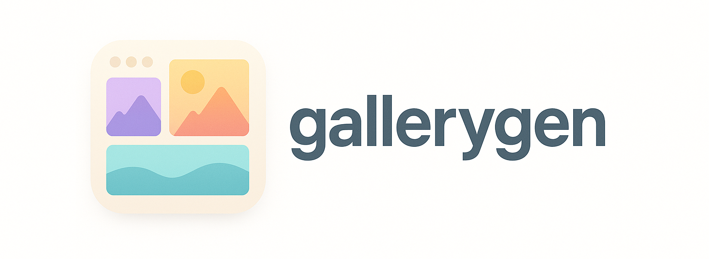

**gallerygen** generates a static HTML gallery from a directory of images.

*Preview:* [dropbox.dzombak.com/gifs](https://dropbox.dzombak.com/gifs)

## Usage

```text
gallerygen [OPTIONS] --dir /path/to/images
```

Generates a static HTML gallery from the specified directory of images. The gallery includes:
- Mobile-friendly design & responsive image grid layout
- Blurhash image placeholders
- Client-side image search with keyboard shortcuts (Esc and Cmd+F)
- Searches are persisted in the URL query and can be shared
- Watches the directory for file changes and regenerates the gallery as needed
- Subdirectory support

### Options

- `-dir string`: Directory containing images to process. Required.
- `-oneshot`: Generate gallery once and exit, without watching for changes.
- `-title string`: Title to use for the gallery. (default `dropbox.dzombak.com/gifs`)
- `-version`: Print version and exit.

## Installation

### macOS via Homebrew

```shell
brew install cdzombak/oss/gallerygen
```

### Debian via apt repository

Install my Debian repository if you haven't already:

```shell
sudo apt-get install ca-certificates curl gnupg
sudo install -m 0755 -d /etc/apt/keyrings
curl -fsSL https://dist.cdzombak.net/deb.key | sudo gpg --dearmor -o /etc/apt/keyrings/dist-cdzombak-net.gpg
sudo chmod 0644 /etc/apt/keyrings/dist-cdzombak-net.gpg
echo -e "deb [signed-by=/etc/apt/keyrings/dist-cdzombak-net.gpg] https://dist.cdzombak.net/deb/oss any oss\n" | sudo tee -a /etc/apt/sources.list.d/dist-cdzombak-net.list > /dev/null
sudo apt-get update
```

Then install `gallerygen` via `apt-get`:

```shell
sudo apt-get install gallerygen
```

### Manual installation from build artifacts

Pre-built binaries for Linux and macOS on various architectures are downloadable from each [GitHub Release](https://github.com/cdzombak/gallerygen/releases). Debian packages for each release are available as well.

### Build and install locally

```shell
git clone https://github.com/cdzombak/gallerygen.git
cd gallerygen
make build

cp out/gallerygen $INSTALL_DIR
```

## Docker images

Docker images are available for a variety of Linux architectures from [Docker Hub](https://hub.docker.com/r/cdzombak/gallerygen) and [GHCR](https://github.com/cdzombak/gallerygen/pkgs/container/gallerygen). Images are based on the `scratch` image and are as small as possible.

Run them via:

```shell
docker run --rm -v /path/to/images:/images cdzombak/gallerygen:1 -dir /images

docker run --rm -v /path/to/images:/images ghcr.io/cdzombak/gallerygen:1 -dir /images -title "My Gallery"
```

Note that when using Docker, you must map the image directory into the container.

## About

- Issues: https://github.com/cdzombak/gallerygen/issues/new
- Author: [Chris Dzombak](https://www.dzombak.com)
  - [GitHub: @cdzombak](https://www.github.com/cdzombak)

## License

LGPLv3; see `LICENSE` in this repository.
